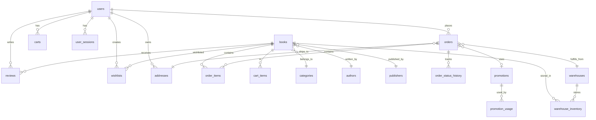

# **USER REQUIREMENTS DOCUMENT (URD) - PHIÊN BẢN HOÀN THIỆN**

## **HỆ THỐNG BACKEND SÀN THƯƠNG MẠI ĐIỆN TỬ BÁN SÁCH ONLINE**

**Phiên bản:** 2.0 | **Ngày:** 31/10/2025
**Công nghệ:** Go (Golang) + PostgreSQL + Redis + Asynq
**Kiến trúc:** Clean Architecture, Modular Monolith
**Tác giả:** [Tên team/công ty]
**Trạng thái:** Draft for Review

***

## **PHẦN 1: TỔNG QUAN Dự ÁN**

### **1.1 Mục Đích Tài Liệu**

Tài liệu này mô tả đầy đủ các yêu cầu nghiệp vụ, chức năng và kỹ thuật cho hệ thống backend sàn thương mại điện tử bán sách. Tài liệu phục vụ làm cơ sở cho thiết kế, phát triển, testing và làm thỏa thuận giữa stakeholders và development team.[^2][^4]

### **1.2 Bối Cảnh Kinh Doanh**

**Vấn đề cần giải quyết:**

- Thị trường sách online tại Việt Nam đang phát triển với tốc độ 25% năm
- Người dùng cần trải nghiệm mua sách nhanh, tiện lợi, hỗ trợ cả sách giấy và ebook
- Nhà xuất bản/phát hành cần kênh phân phối hiệu quả với quản lý kho đa điểm

**Cơ hội:**

- Target: 100,000 users trong năm đầu
- Doanh thu dự kiến: 20 tỷ VNĐ/năm
- Conversion rate mục tiêu: 3-5%
- Average Order Value: 200,000 VNĐ


### **1.3 Mục Tiêu Hệ Thống**

| Mục tiêu | Chỉ số đo lường (KPI) |
| :-- | :-- |
| Hiệu suất | P95 latency < 200ms, throughput 1000 RPS |
| Độ tin cậy | Uptime 99.9% (max 8.76 giờ downtime/năm) |
| Khả năng mở rộng | Scale từ 1,000 → 100,000 concurrent users |
| Bảo mật | Zero data breach, PCI DSS compliant |
| Trải nghiệm | Checkout completion rate > 70% |

### **1.4 Phạm Vi Dự Án**

**Trong phạm vi:**

- Backend API cho web và mobile app
- Quản lý sản phẩm sách (giấy + ebook)
- Hệ thống đặt hàng và thanh toán
- Quản lý kho đa điểm
- Admin dashboard APIs
- Background job processing
- Reporting \& analytics APIs

**Ngoài phạm vi:**

- Frontend web/mobile development
- DevOps infrastructure setup (chỉ cung cấp Dockerfile)
- Marketing automation platform
- Customer data platform (CDP)


### **1.5 Stakeholders**

| Vai trò | Trách nhiệm | Số lượng |
| :-- | :-- | :-- |
| **End Users** | Mua sách, đánh giá | 100,000+ |
| **Admin** | Quản lý toàn hệ thống | 2-3 |
| **Seller** | Upload sách, quản lý giá | 50+ |
| **Warehouse Staff** | Cập nhật tồn kho, đóng gói | 10+ |
| **CSKH** | Xử lý khiếu nại, hoàn tiền | 5+ |
| **Marketing** | Tạo campaign, voucher | 2-3 |


***

## **PHẦN 2: RỦI RO, GIẢ ĐỊNH VÀ RÀNG BUỘC**

### **2.1 Rủi Ro Đã Xác Định**

| ID | Rủi ro | Mức độ | Biện pháp giảm thiểu |
| :-- | :-- | :-- | :-- |
| R001 | Payment gateway downtime | High | Hỗ trợ 3 gateway (VNPay, Momo, COD), auto fallback |
| R002 | Race condition overselling | High | Pessimistic locking, inventory reservation |
| R003 | Database bottleneck | Medium | Connection pooling (max 100), read replicas |
| R004 | Redis failure | Medium | Graceful degradation, DB fallback |
| R005 | Third-party API rate limit | Medium | Circuit breaker, exponential backoff |

### **2.2 Giả Định**

- Cloud infrastructure sẵn sàng (AWS/GCP) với VPC, Load Balancer
- Email service (AWS SES hoặc SendGrid) đã được approve
- Payment gateway accounts đã được tạo và test
- S3/MinIO bucket cho image/ebook storage
- SSL certificate cho domain


### **2.3 Ràng Buộc Kỹ Thuật**

| Loại | Ràng buộc |
| :-- | :-- |
| **Infrastructure** | AWS ap-southeast-1 (Singapore), 2 AZs |
| **Database** | PostgreSQL 15+, max connection 100 |
| **Cache** | Redis 7+, single instance (3GB RAM) |
| **Language** | Go 1.21+, no CGO |
| **Deployment** | Docker container, max image size 500MB |
| **API Protocol** | REST, JSON, no GraphQL |

### **2.4 Ràng Buộc Nghiệp Vụ**

- Chỉ bán sách (không mở rộng điện tử, thời trang)
- Giá sách phải tuân thủ quy định giá cố định (nếu có)
- Hóa đơn điện tử tuân thủ Thông tư 32/2011/TT-BTC
- GDPR/PDPA compliance cho dữ liệu cá nhân
- Không lưu trữ CVV card

***

## **PHẦN 3: KIẾN TRÚC VÀ THIẾT KẾ HỆ THỐNG**

### **3.1 Kiến Trúc Tổng Quan**

```
┌─────────────────────────────────────────────────────────┐
│                     Load Balancer (ALB)                  │
│                  SSL Termination + WAF                   │
└────────────────────────┬────────────────────────────────┘
                         │
        ┌────────────────┴────────────────┐
        │                                  │
┌───────▼────────┐              ┌─────────▼────────┐
│  API Server 1   │              │  API Server 2     │
│  (Go + Gin)     │              │  (Go + Gin)       │
└───────┬────────┘              └─────────┬────────┘
        │                                  │
        └────────────────┬─────────────────┘
                         │
        ┌────────────────┼────────────────┐
        │                │                 │
┌───────▼─────┐  ┌──────▼──────┐  ┌──────▼──────┐
│ PostgreSQL  │  │    Redis     │  │   Asynq     │
│  (Primary)  │  │ (Cache+Queue)│  │  Workers    │
└─────────────┘  └──────────────┘  └──────┬──────┘
                                           │
                         ┌─────────────────┼──────────────┐
                         │                 │              │
                  ┌──────▼──────┐  ┌──────▼──────┐ ┌────▼─────┐
                  │ Email (SES) │  │  S3/MinIO   │ │ Payment  │
                  └─────────────┘  └─────────────┘ │ Gateway  │
                                                    └──────────┘
```


### **3.2 Cấu Trúc Thư Mục (Modular Monolith)**

```bash
bookstore-backend/
├── cmd/
│   ├── api/              # HTTP server entry point
│   ├── worker/           # Background worker entry point
│   └── migrate/          # DB migration CLI
├── internal/
│   ├── domains/          # Domain-driven modules
│   │   ├── book/
│   │   │   ├── handler/
│   │   │   ├── service/
│   │   │   ├── repository/
│   │   │   └── model/
│   │   ├── order/
│   │   ├── user/
│   │   ├── payment/
│   │   ├── inventory/
│   │   └── promotion/
│   ├── shared/           # Shared kernel
│   │   ├── middleware/
│   │   ├── dto/
│   │   ├── errors/
│   │   └── constants/
│   └── infrastructure/   # External integrations
│       ├── cache/
│       ├── queue/
│       ├── email/
│       ├── storage/
│       └── payment/
├── pkg/                  # Public libraries
│   ├── config/
│   ├── logger/
│   ├── db/
│   └── validator/
├── migrations/           # SQL migrations
├── seeds/               # Test data
├── tests/
│   ├── unit/
│   ├── integration/
│   └── e2e/
├── docs/
│   ├── api/             # OpenAPI specs
│   └── architecture/
├── scripts/             # Build, deploy scripts
├── docker-compose.yml
├── Dockerfile
└── README.md
```


### **3.3 Technology Stack**

| Component | Technology | Version | Lý do chọn |
| :-- | :-- | :-- | :-- |
| **Language** | Go | 1.21+ | Performance, concurrency, type safety |
| **Web Framework** | Gin | 1.9+ | Fast router, middleware support |
| **Database** | PostgreSQL | 15+ | ACID, JSON support, full-text search |
| **Cache** | Redis | 7+ | In-memory speed, pub/sub |
| **Queue** | Asynq | 0.24+ | Native Go, Redis-based, UI dashboard |
| **Migration** | golang-migrate | 4.16+ | CLI + library support |
| **Validation** | ozzo-validation | 4.3+ | Flexible, no struct tags |
| **Logging** | Zerolog | 1.31+ | Fast JSON logger |
| **Config** | Viper | 1.17+ | Multi-format config |
| **Testing** | Testify + Testcontainers | Latest | Rich assertions, real containers |


***

## **PHẦN 4: YÊU CẦU CHỨC NĂNG**

### **4.1 Use Case Diagram**

```mermaid
graph TB
    Guest[Guest User]
    User[Registered User]
    Admin[Admin]
    Warehouse[Warehouse Staff]
    CSKH[Customer Support]
    
    Guest --> Browse[Browse Books]
    Guest --> Search[Search Books]
    Guest --> ViewCart[View Cart]
    
    User --> Browse
    User --> Search
    User --> Checkout[Checkout & Pay]
    User --> TrackOrder[Track Order]
    User --> Review[Write Review]
    User --> DownloadEbook[Download eBook]
    
    Admin --> ManageBooks[Manage Books]
    Admin --> ManageBanner[Manage Banners]
    Admin --> ManagePromo[Manage Promotions]
    Admin --> ViewReports[View Reports]
    
    Warehouse --> UpdateInventory[Update Inventory]
    Warehouse --> ProcessOrder[Process Orders]
    
    CSKH --> HandleTicket[Handle Tickets]
    CSKH --> ProcessRefund[Process Refunds]
```




### **4.2 Chi Tiết Functional Requirements**

#### **FR-AUTH: Authentication \& Authorization**

| ID | Requirement | Priority | Acceptance Criteria |
| :-- | :-- | :-- | :-- |
| FR-AUTH-001 | User registration with email verification | MUST | Email với link verify gửi trong 30s, link valid 24h |
| FR-AUTH-002 | Login with email + password | MUST | JWT access token (15m), refresh token (3d) returned |
| FR-AUTH-003 | Password reset flow | MUST | Reset link valid 1h, minimum password strength: 8 chars, 1 upper, 1 number |
| FR-AUTH-004 | OAuth2 login (Google, Facebook) | SHOULD | User có thể link multiple providers |
| FR-AUTH-005 | Multi-factor authentication (2FA) | COULD | TOTP-based, optional |
| FR-AUTH-006 | Session management | MUST | Max 5 concurrent sessions/user, show device list |
| FR-AUTH-007 | Role-based access control (RBAC) | MUST | Roles: guest, user, seller, warehouse, cskh, admin |

**API Endpoints:**

```
POST   /v1/auth/register
POST   /v1/auth/verify-email?token={token}
POST   /v1/auth/login
POST   /v1/auth/refresh
POST   /v1/auth/forgot-password
POST   /v1/auth/reset-password
GET    /v1/auth/sessions
DELETE /v1/auth/sessions/{id}
```


#### **FR-BOOK: Book Management**

| ID | Requirement | Priority | Acceptance Criteria |
| :-- | :-- | :-- | :-- |
| FR-BOOK-001 | Search books by title, author, ISBN, category | MUST | Full-text search với tsvector, kết quả < 100ms cho 10k books |
| FR-BOOK-002 | Filter books by price range, language, publisher | MUST | Support multiple filters, pagination 20 items/page |
| FR-BOOK-003 | View book details | MUST | Include: images, description, reviews, stock, related books |
| FR-BOOK-004 | Multi-level categories | MUST | Tree depth max 3 levels (e.g., Văn học → Tiểu thuyết → Trinh thám) |
| FR-BOOK-005 | Book variants (hardcover, paperback, ebook) | SHOULD | Mỗi variant có SKU, price, stock riêng |
| FR-BOOK-006 | Bulk import books via CSV | MUST | Async job, validate + preview trước khi import |
| FR-BOOK-007 | Book recommendations | SHOULD | Based on viewing history + collaborative filtering |

**API Endpoints:**

```
GET    /v1/books?search={query}&category={id}&price_min={min}&price_max={max}&page={n}
GET    /v1/books/{id}
GET    /v1/books/{id}/recommendations
GET    /v1/categories/tree
POST   /v1/admin/books (Admin only)
PUT    /v1/admin/books/{id}
DELETE /v1/admin/books/{id}
POST   /v1/admin/books/import (Upload CSV)
```


#### **FR-CART: Shopping Cart**

| ID | Requirement | Priority | Acceptance Criteria |
| :-- | :-- | :-- | :-- |
| FR-CART-001 | Add book to cart (guest \& user) | MUST | Guest cart lưu Redis với session ID, user cart lưu DB |
| FR-CART-002 | Update quantity | MUST | Validate stock trước khi update |
| FR-CART-003 | Remove item | MUST | Soft delete, có thể restore trong 1 phút |
| FR-CART-004 | Cart expiration | MUST | Guest cart expire sau 30 phút last activity, warning sau 25 phút |
| FR-CART-005 | Cart merging | MUST | Merge guest cart vào user cart khi login |
| FR-CART-006 | Apply promo code | MUST | Validate code + usage limit, show discount trước checkout |

**API Endpoints:**

```
GET    /v1/cart
POST   /v1/cart/items
PATCH  /v1/cart/items/{book_id}
DELETE /v1/cart/items/{book_id}
POST   /v1/cart/apply-promo
DELETE /v1/cart/promo
```


#### **FR-ORDER: Order Management**

| ID | Requirement | Priority | Acceptance Criteria |
| :-- | :-- | :-- | :-- |
| FR-ORDER-001 | Checkout with address validation | MUST | Validate address format, phone number, support GHN/GHTK API |
| FR-ORDER-002 | Multiple payment methods | MUST | COD, VNPay, Momo với auto fallback nếu gateway down |
| FR-ORDER-003 | Inventory reservation | MUST | Reserve stock khi tạo order, release nếu payment fail sau 15 phút |
| FR-ORDER-004 | Order status tracking | MUST | States: pending → confirmed → processing → shipped → delivered → completed |
| FR-ORDER-005 | Cancel order | MUST | User có thể cancel trước khi "processing", auto refund nếu đã pay |
| FR-ORDER-006 | Order history | MUST | Pagination, filter by status/date range |
| FR-ORDER-007 | Reorder | SHOULD | Clone previous order với validation stock |
| FR-ORDER-008 | Split shipment | COULD | Nếu 1 item hết hàng, cho phép ship partial |

**Order Status Flow:**

```
Pending Payment → Payment Failed (Cancel)
                → Payment Success → Confirmed → Processing → Shipped → Delivered → Completed
                                                         → Cancelled (before ship)
                                                                    → Return Requested → Refunded
```

**API Endpoints:**

```
POST   /v1/orders
GET    /v1/orders
GET    /v1/orders/{id}
PATCH  /v1/orders/{id}/cancel
POST   /v1/orders/{id}/reorder
GET    /v1/orders/{id}/invoice (PDF)
```


#### **FR-PAYMENT: Payment Processing**

| ID | Requirement | Priority | Acceptance Criteria |
| :-- | :-- | :-- | :-- |
| FR-PAY-001 | VNPay integration | MUST | IPN callback validation, 3 retry failed payment |
| FR-PAY-002 | Momo integration | MUST | QR code generation, deep link support |
| FR-PAY-003 | Cash on Delivery | MUST | Charge extra 15,000 VNĐ |
| FR-PAY-004 | Payment timeout | MUST | Order auto cancel sau 15 phút nếu chưa payment |
| FR-PAY-005 | Refund processing | MUST | Auto refund qua gateway trong 7 ngày làm việc |
| FR-PAY-006 | Payment webhook handling | MUST | Idempotent, log all webhooks, retry logic |

**API Endpoints:**

```
POST   /v1/payments/vnpay/create
POST   /v1/payments/momo/create
POST   /v1/webhooks/vnpay (IPN)
POST   /v1/webhooks/momo
POST   /v1/admin/payments/{id}/refund
```


#### **FR-INVENTORY: Multi-Warehouse Inventory**

| ID | Requirement | Priority | Acceptance Criteria |
| :-- | :-- | :-- | :-- |
| FR-INV-001 | Track stock per warehouse | MUST | Real-time sync, no data race |
| FR-INV-002 | Automatic warehouse selection | MUST | Chọn kho gần address nhất có stock |
| FR-INV-003 | Stock reservation | MUST | Pessimistic lock khi checkout, timeout 15m |
| FR-INV-004 | Low stock alert | SHOULD | Email admin khi stock < threshold |
| FR-INV-005 | Stock adjustment log | MUST | Audit trail: who, when, reason, old/new value |
| FR-INV-006 | Batch stock update | MUST | CSV import với validation |

**Database Design:**

```sql
CREATE TABLE warehouses (
    id UUID PRIMARY KEY,
    name TEXT NOT NULL,
    address TEXT,
    latitude DECIMAL(9,6),
    longitude DECIMAL(9,6),
    is_active BOOLEAN DEFAULT true
);

CREATE TABLE warehouse_inventory (
    warehouse_id UUID REFERENCES warehouses(id),
    book_id UUID REFERENCES books(id),
    quantity INT NOT NULL CHECK (quantity >= 0),
    reserved INT NOT NULL DEFAULT 0 CHECK (reserved >= 0),
    alert_threshold INT DEFAULT 10,
    updated_at TIMESTAMPTZ DEFAULT NOW(),
    PRIMARY KEY (warehouse_id, book_id),
    CONSTRAINT available_stock CHECK (quantity >= reserved)
);

CREATE INDEX idx_inventory_book ON warehouse_inventory(book_id) WHERE quantity > 0;
```


#### **FR-REVIEW: Review \& Rating**

| ID | Requirement | Priority | Acceptance Criteria |
| :-- | :-- | :-- | :-- |
| FR-REV-001 | Write review after delivery | MUST | Chỉ user đã mua và nhận hàng mới review được |
| FR-REV-002 | Rating 1-5 stars + comment | MUST | Rating required, comment optional (max 1000 chars) |
| FR-REV-003 | Upload review images | SHOULD | Max 5 images, resize to 800x800 |
| FR-REV-004 | Review moderation | MUST | Admin có thể hide review spam/offensive |
| FR-REV-005 | Helpful votes | SHOULD | Users vote review hữu ích, sort by helpfulness |

#### **FR-PROMO: Promotions \& Discounts**

| ID | Requirement | Priority | Acceptance Criteria |
| :-- | :-- | :-- | :-- |
| FR-PROMO-001 | Percentage discount code | MUST | e.g., SUMMER20 = 20% off, max discount 100k |
| FR-PROMO-002 | Fixed amount discount | MUST | e.g., FREESHIP = -30k |
| FR-PROMO-003 | Usage limits | MUST | Per user, total usage, valid date range |
| FR-PROMO-004 | Conditions | SHOULD | Minimum order value, specific categories |
| FR-PROMO-005 | Flash sale | SHOULD | Time-based, limited stock |
| FR-PROMO-006 | Bundle deals | COULD | Buy 3 get 10% off |

#### **FR-EBOOK: eBook Management**

| ID | Requirement | Priority | Acceptance Criteria |
| :-- | :-- | :-- | :-- |
| FR-EBOOK-001 | Download link generation | MUST | Presigned URL valid 1h, regenerate unlimited trong 30 ngày |
| FR-EBOOK-002 | DRM protection | SHOULD | Watermark PDF với user email + order ID |
| FR-EBOOK-003 | Format support | MUST | PDF, EPUB, max file size 50MB |
| FR-EBOOK-004 | Download limit | MUST | Max 5 downloads/day để chống abuse |

#### **FR-ADMIN: Admin Functions**

| ID | Requirement | Priority | Acceptance Criteria |
| :-- | :-- | :-- | :-- |
| FR-ADM-001 | Dashboard with KPIs | MUST | Revenue, orders, users, top books (real-time) |
| FR-ADM-002 | Banner management | MUST | CRUD, position (hero, sidebar), schedule start/end |
| FR-ADM-003 | User management | MUST | View, suspend, change role |
| FR-ADM-004 | Export reports | MUST | Sales report CSV/Excel by date range |
| FR-ADM-005 | System settings | MUST | Tax rate, shipping fees, email templates |


***

## **PHẦN 5: YÊU CẦU PHI CHỨC NĂNG**

### **5.1 Performance Requirements**

| Metric | Target | Measurement |
| :-- | :-- | :-- |
| API Response Time (P95) | < 200ms | Prometheus histogram |
| API Response Time (P99) | < 500ms | Prometheus histogram |
| Database Query Time (P95) | < 50ms | pg_stat_statements |
| Throughput | 1000 RPS | Load test with k6 |
| Concurrent Users | 10,000 | Sustained for 1 hour |
| Page Load Time | < 3s | Lighthouse score > 90 |

### **5.2 Scalability Requirements**

- **Horizontal Scaling:** API servers scale từ 2 → 20 instances
- **Database:** Support read replicas, connection pool max 100
- **Cache:** Redis cluster ready (hiện tại single instance)
- **Storage:** S3 unlimited capacity
- **Queue:** Asynq handle 10,000 jobs/minute


### **5.3 Availability \& Reliability**

| Requirement | Target | Implementation |
| :-- | :-- | :-- |
| Uptime SLA | 99.9% | Multi-AZ deployment, health checks |
| Recovery Time Objective (RTO) | < 4 hours | Automated backup restore scripts |
| Recovery Point Objective (RPO) | < 1 hour | Continuous WAL archiving |
| Error Rate | < 0.1% | Circuit breaker, retry logic |
| Data Durability | 99.999999999% | S3 standard storage class |

### **5.4 Security Requirements**

#### **Authentication \& Authorization**

- JWT with HMAC-SHA256, access token 15m, refresh token 3d with rotation
- Bcrypt password hashing (cost 12)
- Failed login lockout: 5 attempts → block 15 minutes
- Session timeout: 30 minutes inactivity


#### **Data Protection**

- TLS 1.3 for all API communications
- Database encryption at rest (AWS RDS encryption)
- PII data encrypted in database (AES-256)
- No credit card data stored (tokenization only)


#### **Input Validation**

- All inputs validated with ozzo-validation
- SQL injection prevention (parameterized queries)
- XSS prevention (sanitize HTML)
- CSRF protection for cookie-based sessions


#### **Rate Limiting**

| Endpoint Type | Limit | Window |
| :-- | :-- | :-- |
| Login/Register | 5 requests | 1 minute |
| Checkout | 10 requests | 1 minute |
| General API | 100 requests | 1 minute |
| Admin API | 1000 requests | 1 minute |

#### **Compliance**

- GDPR: Right to access, delete, export data
- PCI DSS Level 1 (via payment gateway)
- PDPA (Vietnam): Data consent, privacy policy
- OWASP Top 10 coverage


### **5.5 Monitoring \& Observability**

#### **Logging**

```json
{
  "timestamp": "2025-10-31T09:30:00Z",
  "level": "info",
  "request_id": "req-abc123",
  "user_id": "user-xyz",
  "method": "POST",
  "path": "/v1/orders",
  "status": 201,
  "duration_ms": 145,
  "error": null
}
```

**Retention:** 30 days in Loki/ELK

#### **Metrics (Prometheus)**

- `http_request_duration_seconds` (histogram)
- `http_requests_total` (counter) by status code
- `db_query_duration_seconds` (histogram)
- `cache_hit_ratio` (gauge)
- `queue_jobs_pending` (gauge)
- `active_users` (gauge)


#### **Health Checks**

- `GET /health` → 200 OK if DB + Redis reachable
- `GET /ready` → 200 OK if all workers running
- Check interval: 10 seconds
- Failure threshold: 3 consecutive fails


#### **Alerting**

| Alert | Condition | Severity |
| :-- | :-- | :-- |
| High Error Rate | > 1% in 5m | Critical |
| Slow Response | P95 > 500ms in 5m | Warning |
| Database Connection Pool Exhausted | > 95% used | Critical |
| Queue Backlog | > 1000 jobs | Warning |
| Low Disk Space | < 10% free | Critical |

### **5.6 Backup \& Disaster Recovery**

#### **Database Backup**

- **Full Backup:** Daily at 2 AM UTC → S3
- **Incremental:** WAL archiving every 5 minutes
- **Retention:** 30 days rolling
- **Testing:** Monthly restore drill


#### **Disaster Recovery Plan**

1. **Detection:** Automated alerts + on-call engineer (< 5 minutes)
2. **Assessment:** Determine scope (< 15 minutes)
3. **Recovery:** Restore from backup or failover (< 4 hours)
4. **Validation:** Data integrity checks, smoke tests
5. **Post-mortem:** Root cause analysis within 48 hours

***

## **PHẦN 6: DATABASE SCHEMA (HOÀN THIỆN)**

### **6.1 ERD Diagram**




### **6.2 Bảng Chi Tiết**

#### **users**

```sql
CREATE TABLE users (
    id UUID PRIMARY KEY DEFAULT gen_random_uuid(),
    email TEXT UNIQUE NOT NULL,
    password_hash TEXT NOT NULL,
    full_name TEXT NOT NULL,
    phone TEXT,
    role TEXT NOT NULL DEFAULT 'user' CHECK (role IN ('guest', 'user', 'seller', 'warehouse', 'cskh', 'admin')),
    points INT NOT NULL DEFAULT 0,
    is_verified BOOLEAN DEFAULT false,
    verification_token TEXT,
    verification_sent_at TIMESTAMPTZ,
    reset_token TEXT,
    reset_token_expires_at TIMESTAMPTZ,
    last_login_at TIMESTAMPTZ,
    created_at TIMESTAMPTZ DEFAULT NOW(),
    updated_at TIMESTAMPTZ DEFAULT NOW(),
    deleted_at TIMESTAMPTZ
);

CREATE INDEX idx_users_email ON users(email) WHERE deleted_at IS NULL;
CREATE INDEX idx_users_role ON users(role);
```


#### **authors**

```sql
CREATE TABLE authors (
    id UUID PRIMARY KEY DEFAULT gen_random_uuid(),
    name TEXT NOT NULL,
    slug TEXT UNIQUE NOT NULL,
    bio TEXT,
    photo_url TEXT,
    created_at TIMESTAMPTZ DEFAULT NOW()
);

CREATE INDEX idx_authors_slug ON authors(slug);
```


#### **publishers**

```sql
CREATE TABLE publishers (
    id UUID PRIMARY KEY DEFAULT gen_random_uuid(),
    name TEXT NOT NULL,
    slug TEXT UNIQUE NOT NULL,
    website TEXT,
    created_at TIMESTAMPTZ DEFAULT NOW()
);
```


#### **categories**

```sql
CREATE TABLE categories (
    id UUID PRIMARY KEY DEFAULT gen_random_uuid(),
    name TEXT NOT NULL,
    slug TEXT UNIQUE NOT NULL,
    parent_id UUID REFERENCES categories(id) ON DELETE CASCADE,
    sort_order INT DEFAULT 0,
    created_at TIMESTAMPTZ DEFAULT NOW()
);

CREATE INDEX idx_categories_parent ON categories(parent_id);
CREATE INDEX idx_categories_slug ON categories(slug);
```


#### **books**

```sql
CREATE TABLE books (
    id UUID PRIMARY KEY DEFAULT gen_random_uuid(),
    title TEXT NOT NULL,
    slug TEXT UNIQUE NOT NULL,
    author_id UUID NOT NULL REFERENCES authors(id),
    publisher_id UUID REFERENCES publishers(id),
    category_id UUID REFERENCES categories(id),
    isbn TEXT UNIQUE,
    price NUMERIC(10,2) NOT NULL CHECK (price >= 0),
    compare_at_price NUMERIC(10,2),
    cover_url TEXT,
    description TEXT,
    pages INT,
    language TEXT DEFAULT 'vi',
    published_year INT,
    format TEXT CHECK (format IN ('paperback', 'hardcover', 'ebook')),
    ebook_file_url TEXT,
    ebook_file_size_mb DECIMAL(5,2),
    is_active BOOLEAN DEFAULT true,
    view_count INT DEFAULT 0,
    search_vector tsvector,
    created_at TIMESTAMPTZ DEFAULT NOW(),
    updated_at TIMESTAMPTZ DEFAULT NOW(),
    deleted_at TIMESTAMPTZ
);

CREATE INDEX idx_books_slug ON books(slug) WHERE deleted_at IS NULL;
CREATE INDEX idx_books_author ON books(author_id);
CREATE INDEX idx_books_category ON books(category_id);
CREATE INDEX idx_books_isbn ON books(isbn) WHERE isbn IS NOT NULL;
CREATE INDEX idx_books_search ON books USING GIN(search_vector);
CREATE INDEX idx_books_price ON books(price) WHERE is_active = true;

-- Trigger auto update search_vector
CREATE TRIGGER books_search_update
    BEFORE INSERT OR UPDATE ON books
    FOR EACH ROW EXECUTE FUNCTION
    tsvector_update_trigger(search_vector, 'pg_catalog.english', title, description);
```


#### **warehouses**

```sql
CREATE TABLE warehouses (
    id UUID PRIMARY KEY DEFAULT gen_random_uuid(),
    name TEXT NOT NULL,
    code TEXT UNIQUE NOT NULL,
    address TEXT NOT NULL,
    province TEXT NOT NULL,
    latitude DECIMAL(9,6),
    longitude DECIMAL(9,6),
    is_active BOOLEAN DEFAULT true,
    created_at TIMESTAMPTZ DEFAULT NOW()
);

CREATE INDEX idx_warehouses_active ON warehouses(is_active);
```


#### **warehouse_inventory**

```sql
CREATE TABLE warehouse_inventory (
    warehouse_id UUID NOT NULL REFERENCES warehouses(id),
    book_id UUID NOT NULL REFERENCES books(id),
    quantity INT NOT NULL DEFAULT 0 CHECK (quantity >= 0),
    reserved INT NOT NULL DEFAULT 0 CHECK (reserved >= 0),
    alert_threshold INT DEFAULT 10,
    last_restocked_at TIMESTAMPTZ,
    updated_at TIMESTAMPTZ DEFAULT NOW(),
    PRIMARY KEY (warehouse_id, book_id),
    CONSTRAINT available_stock CHECK (quantity >= reserved)
);

CREATE INDEX idx_inventory_book ON warehouse_inventory(book_id);
CREATE INDEX idx_inventory_low_stock ON warehouse_inventory(warehouse_id, book_id) 
    WHERE quantity <= alert_threshold;

-- View total stock
CREATE VIEW books_total_stock AS
SELECT 
    book_id,
    SUM(quantity) as total_quantity,
    SUM(reserved) as total_reserved,
    SUM(quantity - reserved) as available
FROM warehouse_inventory
GROUP BY book_id;
```


#### **addresses**

```sql
CREATE TABLE addresses (
    id UUID PRIMARY KEY DEFAULT gen_random_uuid(),
    user_id UUID NOT NULL REFERENCES users(id) ON DELETE CASCADE,
    recipient_name TEXT NOT NULL,
    phone TEXT NOT NULL,
    province TEXT NOT NULL,
    district TEXT NOT NULL,
    ward TEXT NOT NULL,
    street TEXT NOT NULL,
    address_type TEXT CHECK (address_type IN ('home', 'office')),
    is_default BOOLEAN DEFAULT false,
    created_at TIMESTAMPTZ DEFAULT NOW(),
    updated_at TIMESTAMPTZ DEFAULT NOW()
);

CREATE INDEX idx_addresses_user ON addresses(user_id);
CREATE UNIQUE INDEX idx_addresses_default ON addresses(user_id) 
    WHERE is_default = true;
```


#### **carts**

```sql
CREATE TABLE carts (
    id UUID PRIMARY KEY DEFAULT gen_random_uuid(),
    user_id UUID REFERENCES users(id) ON DELETE CASCADE,
    session_id TEXT, -- For guest users
    expires_at TIMESTAMPTZ NOT NULL,
    created_at TIMESTAMPTZ DEFAULT NOW(),
    updated_at TIMESTAMPTZ DEFAULT NOW(),
    CONSTRAINT user_or_session CHECK (
        (user_id IS NOT NULL AND session_id IS NULL) OR
        (user_id IS NULL AND session_id IS NOT NULL)
    )
);

CREATE INDEX idx_carts_user ON carts(user_id);
CREATE INDEX idx_carts_session ON carts(session_id);
CREATE INDEX idx_carts_expires ON carts(expires_at);
```


#### **cart_items**

```sql
CREATE TABLE cart_items (
    cart_id UUID NOT NULL REFERENCES carts(id) ON DELETE CASCADE,
    book_id UUID NOT NULL REFERENCES books(id),
    quantity INT NOT NULL CHECK (quantity > 0),
    added_at TIMESTAMPTZ DEFAULT NOW(),
    PRIMARY KEY (cart_id, book_id)
);
```


#### **promotions**

```sql
CREATE TABLE promotions (
    id UUID PRIMARY KEY DEFAULT gen_random_uuid(),
    code TEXT UNIQUE NOT NULL,
    description TEXT,
    type TEXT NOT NULL CHECK (type IN ('percentage', 'fixed')),
    value NUMERIC(10,2) NOT NULL CHECK (value > 0),
    max_discount_amount NUMERIC(10,2),
    min_order_amount NUMERIC(10,2) DEFAULT 0,
    max_usage INT,
    max_usage_per_user INT DEFAULT 1,
    used_count INT DEFAULT 0,
    category_id UUID REFERENCES categories(id),
    start_at TIMESTAMPTZ NOT NULL,
    end_at TIMESTAMPTZ NOT NULL,
    is_active BOOLEAN DEFAULT true,
    created_at TIMESTAMPTZ DEFAULT NOW(),
    CONSTRAINT valid_dates CHECK (end_at > start_at)
);

CREATE INDEX idx_promotions_code ON promotions(code) WHERE is_active = true;
CREATE INDEX idx_promotions_dates ON promotions(start_at, end_at);
```


#### **orders**

```sql
CREATE TABLE orders (
    id UUID PRIMARY KEY DEFAULT gen_random_uuid(),
    order_number TEXT UNIQUE NOT NULL, -- ORD-20251031-001
    user_id UUID NOT NULL REFERENCES users(id),
    address_id UUID NOT NULL REFERENCES addresses(id),
    warehouse_id UUID REFERENCES warehouses(id),
    subtotal NUMERIC(10,2) NOT NULL,
    discount_amount NUMERIC(10,2) DEFAULT 0,
    shipping_fee NUMERIC(10,2) DEFAULT 0,
    tax_amount NUMERIC(10,2) DEFAULT 0,
    total NUMERIC(10,2) NOT NULL,
    status TEXT NOT NULL DEFAULT 'pending' CHECK (status IN (
        'pending', 'payment_failed', 'confirmed', 'processing', 
        'shipped', 'delivered', 'completed', 'cancelled', 'refunded'
    )),
    payment_method TEXT NOT NULL CHECK (payment_method IN ('cod', 'vnpay', 'momo')),
    payment_status TEXT DEFAULT 'pending' CHECK (payment_status IN ('pending', 'paid', 'failed', 'refunded')),
    payment_id TEXT,
    promotion_id UUID REFERENCES promotions(id),
    tracking_number TEXT,
    shipping_provider TEXT,
    notes TEXT,
    cancelled_reason TEXT,
    cancelled_at TIMESTAMPTZ,
    paid_at TIMESTAMPTZ,
    shipped_at TIMESTAMPTZ,
    delivered_at TIMESTAMPTZ,
    created_at TIMESTAMPTZ DEFAULT NOW(),
    updated_at TIMESTAMPTZ DEFAULT NOW()
) PARTITION BY RANGE (created_at);

-- Partitions by month
CREATE TABLE orders_2025_10 PARTITION OF orders
    FOR VALUES FROM ('2025-10-01') TO ('2025-11-01');

CREATE INDEX idx_orders_user ON orders(user_id, created_at DESC);
CREATE INDEX idx_orders_status ON orders(status);
CREATE INDEX idx_orders_number ON orders(order_number);
```


#### **order_items**

```sql
CREATE TABLE order_items (
    id UUID PRIMARY KEY DEFAULT gen_random_uuid(),
    order_id UUID NOT NULL REFERENCES orders(id) ON DELETE CASCADE,
    book_id UUID NOT NULL REFERENCES books(id),
    book_title TEXT NOT NULL, -- Snapshot
    book_author TEXT NOT NULL,
    quantity INT NOT NULL CHECK (quantity > 0),
    price_at_purchase NUMERIC(10,2) NOT NULL,
    subtotal NUMERIC(10,2) NOT NULL,
    created_at TIMESTAMPTZ DEFAULT NOW()
);

CREATE INDEX idx_order_items_order ON order_items(order_id);
```


#### **order_status_history**

```sql
CREATE TABLE order_status_history (
    id UUID PRIMARY KEY DEFAULT gen_random_uuid(),
    order_id UUID NOT NULL REFERENCES orders(id) ON DELETE CASCADE,
    old_status TEXT,
    new_status TEXT NOT NULL,
    note TEXT,
    changed_by UUID REFERENCES users(id),
    created_at TIMESTAMPTZ DEFAULT NOW()
);

CREATE INDEX idx_status_history_order ON order_status_history(order_id, created_at);
```


#### **reviews**

```sql
CREATE TABLE reviews (
    id UUID PRIMARY KEY DEFAULT gen_random_uuid(),
    book_id UUID NOT NULL REFERENCES books(id) ON DELETE CASCADE,
    user_id UUID NOT NULL REFERENCES users(id),
    order_id UUID NOT NULL REFERENCES orders(id),
    rating INT NOT NULL CHECK (rating >= 1 AND rating <= 5),
    title TEXT,
    comment TEXT,
    images JSONB, -- ["url1", "url2"]
    helpful_count INT DEFAULT 0,
    is_verified_purchase BOOLEAN DEFAULT true,
    is_hidden BOOLEAN DEFAULT false,
    created_at TIMESTAMPTZ DEFAULT NOW(),
    updated_at TIMESTAMPTZ DEFAULT NOW(),
    UNIQUE (book_id, user_id, order_id)
);

CREATE INDEX idx_reviews_book ON reviews(book_id) WHERE is_hidden = false;
CREATE INDEX idx_reviews_user ON reviews(user_id);
CREATE INDEX idx_reviews_rating ON reviews(book_id, rating);
```


#### **wishlists**

```sql
CREATE TABLE wishlists (
    user_id UUID NOT NULL REFERENCES users(id) ON DELETE CASCADE,
    book_id UUID NOT NULL REFERENCES books(id) ON DELETE CASCADE,
    created_at TIMESTAMPTZ DEFAULT NOW(),
    PRIMARY KEY (user_id, book_id)
);
```


#### **banners**

```sql
CREATE TABLE banners (
    id UUID PRIMARY KEY DEFAULT gen_random_uuid(),
    title TEXT NOT NULL,
    image_url TEXT NOT NULL,
    mobile_image_url TEXT,
    link_url TEXT,
    position TEXT NOT NULL CHECK (position IN ('hero', 'sidebar', 'footer')),
    sort_order INT DEFAULT 0,
    start_at TIMESTAMPTZ NOT NULL,
    end_at TIMESTAMPTZ NOT NULL,
    is_active BOOLEAN DEFAULT true,
    click_count INT DEFAULT 0,
    created_at TIMESTAMPTZ DEFAULT NOW(),
    CONSTRAINT valid_dates CHECK (end_at > start_at)
);

CREATE INDEX idx_banners_position ON banners(position, sort_order) 
    WHERE is_active = true AND NOW() BETWEEN start_at AND end_at;
```


#### **audit_logs**

```sql
CREATE TABLE audit_logs (
    id UUID PRIMARY KEY DEFAULT gen_random_uuid(),
    user_id UUID REFERENCES users(id),
    action TEXT NOT NULL, -- CREATE, UPDATE, DELETE
    table_name TEXT NOT NULL,
    record_id TEXT NOT NULL,
    old_data JSONB,
    new_data JSONB,
    ip_address INET,
    user_agent TEXT,
    created_at TIMESTAMPTZ DEFAULT NOW()
) PARTITION BY RANGE (created_at);

-- Partitions by quarter
CREATE INDEX idx_audit_logs_user ON audit_logs(user_id, created_at DESC);
CREATE INDEX idx_audit_logs_table ON audit_logs(table_name, record_id);
```


***

## **PHẦN 7: API SPECIFICATION**

### **7.1 API Design Principles**

- RESTful conventions
- JSON request/response
- Versioning: `/v1/` prefix
- HTTP status codes standard
- Pagination: `?page=1&limit=20`
- Filtering: `?status=active&category=fiction`
- Sorting: `?sort=price:asc,created_at:desc`


### **7.2 Standard Response Format**

**Success Response:**

```json
{
  "success": true,
  "data": { ... },
  "meta": {
    "page": 1,
    "limit": 20,
    "total": 150
  }
}
```

**Error Response:**

```json
{
  "success": false,
  "error": {
    "code": "INVALID_INPUT",
    "message": "Validation failed",
    "details": [
      {
        "field": "email",
        "message": "Invalid email format"
      }
    ]
  },
  "request_id": "req-abc123"
}
```


### **7.3 Error Codes**

| Code | HTTP Status | Description |
| :-- | :-- | :-- |
| AUTH_001 | 401 | Invalid credentials |
| AUTH_002 | 401 | Token expired |
| AUTH_003 | 403 | Insufficient permissions |
| VAL_001 | 400 | Validation error |
| RES_001 | 404 | Resource not found |
| BIZ_001 | 409 | Out of stock |
| BIZ_002 | 409 | Promo code expired |
| SYS_001 | 500 | Internal server error |
| SYS_002 | 503 | Service unavailable |

### **7.4 API Endpoints Summary**

#### **Authentication**

```
POST   /v1/auth/register
POST   /v1/auth/verify-email
POST   /v1/auth/login
POST   /v1/auth/logout
POST   /v1/auth/refresh
POST   /v1/auth/forgot-password
POST   /v1/auth/reset-password
GET    /v1/auth/me
```


#### **Books**

```
GET    /v1/books
GET    /v1/books/{id}
GET    /v1/books/{id}/recommendations
GET    /v1/books/{id}/reviews
POST   /v1/books/{id}/reviews (Auth required)
```


#### **Categories**

```
GET    /v1/categories
GET    /v1/categories/tree
GET    /v1/categories/{slug}
```


#### **Cart**

```
GET    /v1/cart
POST   /v1/cart/items
PATCH  /v1/cart/items/{book_id}
DELETE /v1/cart/items/{book_id}
POST   /v1/cart/promo
DELETE /v1/cart/promo
DELETE /v1/cart (Clear cart)
```


#### **Orders**

```
GET    /v1/orders (Auth required)
POST   /v1/orders (Auth required)
GET    /v1/orders/{id} (Auth required)
PATCH  /v1/orders/{id} (Update status, Auth required)
POST   /v1/orders/{id}/reorder (Auth required)
GET    /v1/orders/{id}/invoice (PDF, Auth required)
GET    /v1/orders/{id}/tracking (Auth required)
```


#### **Payments**

```
POST   /v1/payments/vnpay/create
GET    /v1/payments/vnpay/return (Redirect callback)
POST   /v1/webhooks/vnpay (IPN)
POST   /v1/payments/momo/create
POST   /v1/webhooks/momo
```


#### **User Profile**

```
GET    /v1/user/profile (Auth required)
PATCH  /v1/user/profile (Auth required)
GET    /v1/user/addresses (Auth required)
POST   /v1/user/addresses (Auth required)
PATCH  /v1/user/addresses/{id} (Auth required)
DELETE /v1/user/addresses/{id} (Auth required)
GET    /v1/user/wishlist (Auth required)
POST   /v1/user/wishlist (Auth required)
DELETE /v1/user/wishlist/{book_id} (Auth required)
GET    /v1/user/points (Auth required)
```


#### **eBooks**

```
POST   /v1/ebooks/{id}/download-link (Auth required, generate presigned URL)
GET    /v1/user/ebooks (List purchased ebooks, Auth required)
```


#### **Admin - Books**

```
GET    /v1/admin/books (Admin)
POST   /v1/admin/books (Admin)
PUT    /v1/admin/books/{id} (Admin)
DELETE /v1/admin/books/{id} (Admin, soft delete)
POST   /v1/admin/books/import (CSV upload, Admin)
GET    /v1/admin/books/import/{job_id} (Check import status)
```


#### **Admin - Inventory**

```
GET    /v1/admin/inventory (Admin)
PATCH  /v1/admin/inventory/{warehouse_id}/{book_id} (Admin)
POST   /v1/admin/inventory/bulk-update (CSV, Admin)
GET    /v1/admin/inventory/alerts (Low stock, Admin)
```


#### **Admin - Orders**

```
GET    /v1/admin/orders (Admin)
PATCH  /v1/admin/orders/{id}/status (Admin)
POST   /v1/admin/orders/{id}/refund (Admin)
```


#### **Admin - Promotions**

```
GET    /v1/admin/promotions (Admin)
POST   /v1/admin/promotions (Admin)
PUT    /v1/admin/promotions/{id} (Admin)
DELETE /v1/admin/promotions/{id} (Admin)
GET    /v1/admin/promotions/{id}/usage (Admin)
```


#### **Admin - Banners**

```
GET    /v1/admin/banners (Admin)
POST   /v1/admin/banners (Admin)
PUT    /v1/admin/banners/{id} (Admin)
DELETE /v1/admin/banners/{id} (Admin)
```


#### **Admin - Reports**

```
GET    /v1/admin/reports/sales (Admin, ?start_date=&end_date=)
GET    /v1/admin/reports/top-books (Admin)
GET    /v1/admin/reports/revenue (Admin)
POST   /v1/admin/reports/export (CSV/Excel, Admin)
```


#### **Admin - Users**

```
GET    /v1/admin/users (Admin)
GET    /v1/admin/users/{id} (Admin)
PATCH  /v1/admin/users/{id}/suspend (Admin)
PATCH  /v1/admin/users/{id}/role (Admin)
```


#### **Public**

```
GET    /v1/banners (Active banners)
GET    /health (Health check)
GET    /ready (Readiness check)
GET    /metrics (Prometheus metrics, internal only)
```


***

## **PHẦN 8: BACKGROUND JOBS \& QUEUE**

### **8.1 Asynq Configuration**

```go
// Priority levels
const (
    QueueCritical = "critical" // Payment processing
    QueueHigh     = "high"     // Emails
    QueueDefault  = "default"  // General tasks
    QueueLow      = "low"      // Analytics
)

// Concurrency
critical: 10 workers
high: 20 workers
default: 15 workers
low: 5 workers
```


### **8.2 Job Definitions**

| Job Name | Trigger | Priority | Timeout | Retry | Payload |
| :-- | :-- | :-- | :-- | :-- | :-- |
| **SendOrderConfirmation** | order.created | High | 30s | 3 | order_id |
| **SendPaymentReminder** | order.pending + 10m | High | 30s | 2 | order_id |
| **ExpireCart** | cart.updated + 30m | Default | 10s | 1 | cart_id |
| **UpdateOrderStatus** | webhook received | Critical | 60s | 5 | order_id, status |
| **GenerateInvoicePDF** | order.paid | High | 60s | 3 | order_id |
| **SyncInventory** | inventory.updated | Default | 120s | 3 | warehouse_id, book_id |
| **SendLowStockAlert** | inventory < threshold | Default | 30s | 2 | book_id, warehouse_id |
| **ProcessRefund** | admin action | Critical | 120s | 5 | order_id |
| **SendFlashSaleReminder** | flash_sale.start - 1h | High | 30s | 2 | promotion_id |
| **CleanupExpiredTokens** | Cron daily 2 AM | Low | 300s | 1 | - |
| **GenerateDailyReport** | Cron daily 6 AM | Low | 600s | 2 | date |
| **WatermarkEbook** | ebook purchased | High | 180s | 3 | order_id, book_id, user_email |

### **8.3 Dead Letter Queue**

- Failed jobs sau max retry → move to DLQ
- Retention: 7 days
- Manual replay via admin panel
- Alert khi DLQ > 100 jobs

***

## **PHẦN 9: PHÂN CHIA PHASES PHÁT TRIỂN**

### **Phase 1: MVP - Core E-commerce (8 tuần)**

**Mục tiêu:** Launch hệ thống cơ bản để người dùng có thể mua sách

#### **Sprint 1-2: Foundation (2 tuần)**

**Priority: CRITICAL**


| Task ID | Task | Effort (days) | Dependencies |
| :-- | :-- | :-- | :-- |
| P1-T001 | Project setup (Go modules, folder structure) | 1 | - |
| P1-T002 | Database setup (PostgreSQL, migrations) | 2 | P1-T001 |
| P1-T003 | Core tables: users, books, authors, publishers, categories | 3 | P1-T002 |
| P1-T004 | Redis setup + connection pooling | 1 | P1-T001 |
| P1-T005 | Config management (Viper + env) | 1 | P1-T001 |
| P1-T006 | Logging infrastructure (Zerolog) | 1 | P1-T001 |
| P1-T007 | Error handling utilities | 1 | P1-T001 |
| P1-T008 | Middleware: RequestID, Logging, CORS, Panic Recovery | 2 | P1-T001 |

**Deliverables:**

- ✅ Project structure theo modular monolith
- ✅ Database schema core tables
- ✅ Basic middlewares
- ✅ Config + logging working


#### **Sprint 3-4: Authentication \& Book Listing (2 tuần)**

**Priority: CRITICAL**


| Task ID | Task | Effort (days) | Dependencies |
| :-- | :-- | :-- | :-- |
| P1-T009 | User registration API | 2 | P1-T003 |
| P1-T010 | Email verification (mock SMTP) | 2 | P1-T009 |
| P1-T011 | Login API (JWT generation) | 2 | P1-T009 |
| P1-T012 | JWT middleware | 1 | P1-T011 |
| P1-T013 | Refresh token API | 1 | P1-T011 |
| P1-T014 | Password reset flow | 2 | P1-T009 |
| P1-T015 | Book listing API với pagination | 2 | P1-T003 |
| P1-T016 | Book detail API | 1 | P1-T003 |
| P1-T017 | Category tree API | 1 | P1-T003 |
| P1-T018 | Basic search (LIKE query) | 1 | P1-T015 |

**Deliverables:**

- ✅ Authentication flow complete
- ✅ Users có thể browse sách
- ✅ Basic search working


#### **Sprint 5-6: Cart \& Checkout (2 tuần)**

**Priority: CRITICAL**


| Task ID | Task | Effort (days) | Dependencies |
| :-- | :-- | :-- | :-- |
| P1-T019 | Cart tables (carts, cart_items) | 1 | P1-T002 |
| P1-T020 | Add to cart API (guest + user) | 2 | P1-T019 |
| P1-T021 | Update/Delete cart items | 1 | P1-T020 |
| P1-T022 | Get cart API | 1 | P1-T020 |
| P1-T023 | Cart expiration logic (Redis TTL) | 1 | P1-T020 |
| P1-T024 | Address management APIs | 2 | P1-T003 |
| P1-T025 | Order creation API (COD only) | 3 | P1-T024 |
| P1-T026 | Inventory reservation logic | 2 | P1-T025 |
| P1-T027 | Order listing API | 1 | P1-T025 |
| P1-T028 | Order detail API | 1 | P1-T025 |

**Deliverables:**

- ✅ Full cart flow
- ✅ COD checkout working
- ✅ Basic inventory management


#### **Sprint 7-8: Admin Panel \& Polish (2 tuần)**

**Priority: HIGH**


| Task ID | Task | Effort (days) | Dependencies |
| :-- | :-- | :-- | :-- |
| P1-T029 | RBAC middleware | 2 | P1-T012 |
| P1-T030 | Admin: Create/Edit/Delete books | 3 | P1-T029 |
| P1-T031 | Admin: View orders | 1 | P1-T029 |
| P1-T032 | Admin: Update order status | 2 | P1-T031 |
| P1-T033 | Email templates + sender (AWS SES) | 2 | - |
| P1-T034 | Send order confirmation email | 1 | P1-T033, P1-T025 |
| P1-T035 | Rate limiting middleware | 1 | P1-T008 |
| P1-T036 | Input validation (ozzo-validation) | 2 | - |
| P1-T037 | Unit tests (coverage > 60%) | 3 | All above |
| P1-T038 | Dockerize application | 1 | P1-T001 |

**Deliverables:**

- ✅ Admin có thể quản lý sách và đơn hàng
- ✅ Email notifications
- ✅ Basic security measures
- ✅ Docker ready

**Phase 1 Total:** 55 man-days ≈ 8 tuần (1 developer)

***

### **Phase 2: Payment \& Advanced Features (6 tuần)**

**Mục tiêu:** Thêm payment gateways, promotions, reviews

#### **Sprint 9-10: Payment Integration (2 tuần)**

**Priority: HIGH**


| Task ID | Task | Effort (days) | Dependencies |
| :-- | :-- | :-- | :-- |
| P2-T001 | VNPay SDK integration | 3 | P1-T025 |
| P2-T002 | VNPay payment creation API | 2 | P2-T001 |
| P2-T003 | VNPay IPN webhook handler | 2 | P2-T001 |
| P2-T004 | VNPay return URL handler | 1 | P2-T001 |
| P2-T005 | Momo SDK integration | 3 | P1-T025 |
| P2-T006 | Momo payment flow | 2 | P2-T005 |
| P2-T007 | Payment timeout job (Asynq) | 1 | P2-T001 |
| P2-T008 | Asynq setup + basic jobs | 2 | - |

**Deliverables:**

- ✅ VNPay + Momo payment working
- ✅ Background job system


#### **Sprint 11-12: Promotions \& Reviews (2 tuần)**

**Priority: MEDIUM**


| Task ID | Task | Effort (days) | Dependencies |
| :-- | :-- | :-- | :-- |
| P2-T009 | Promotions table + seed data | 1 | P1-T002 |
| P2-T010 | Apply promo code to cart API | 2 | P2-T009 |
| P2-T011 | Validate promo usage limits | 1 | P2-T010 |
| P2-T012 | Admin: CRUD promotions | 2 | P1-T029 |
| P2-T013 | Reviews table | 1 | P1-T002 |
| P2-T014 | Create review API (after delivery) | 2 | P2-T013 |
| P2-T015 | List reviews for book | 1 | P2-T013 |
| P2-T016 | Admin: Hide/Show reviews | 1 | P2-T013 |
| P2-T017 | Helpful votes on reviews | 1 | P2-T013 |

**Deliverables:**

- ✅ Promo code system
- ✅ Review \& rating system


#### **Sprint 13-14: Wishlist \& Banners (2 tuần)**

**Priority: MEDIUM**


| Task ID | Task | Effort (days) | Dependencies |
| :-- | :-- | :-- | :-- |
| P2-T018 | Wishlist table | 0.5 | P1-T002 |
| P2-T019 | Add/Remove wishlist APIs | 1 | P2-T018 |
| P2-T020 | Get wishlist API | 0.5 | P2-T018 |
| P2-T021 | Banners table | 0.5 | P1-T002 |
| P2-T022 | Admin: CRUD banners | 2 | P1-T029 |
| P2-T023 | Public: Get active banners | 0.5 | P2-T021 |
| P2-T024 | Banner click tracking | 1 | P2-T021 |
| P2-T025 | Full-text search (tsvector) | 2 | P1-T018 |
| P2-T026 | Advanced filters (price, language) | 1 | P1-T015 |
| P2-T027 | Integration tests (Testcontainers) | 3 | All above |

**Deliverables:**

- ✅ Wishlist feature
- ✅ Banner management
- ✅ Advanced search

**Phase 2 Total:** 35 man-days ≈ 6 tuần

***

### **Phase 3: Inventory \& eBook (4 tuần)**

**Mục tiêu:** Multi-warehouse, ebook download

#### **Sprint 15-16: Multi-Warehouse (2 tuần)**

**Priority: HIGH**


| Task ID | Task | Effort (days) | Dependencies |
| :-- | :-- | :-- | :-- |
| P3-T001 | Warehouses + warehouse_inventory tables | 1 | P1-T002 |
| P3-T002 | Migrate existing stock to warehouse model | 1 | P3-T001 |
| P3-T003 | Warehouse selection algorithm (nearest) | 2 | P3-T001 |
| P3-T004 | Update order flow với warehouse_id | 2 | P3-T003 |
| P3-T005 | Admin: Warehouse CRUD | 2 | P1-T029 |
| P3-T006 | Admin: Inventory management per warehouse | 2 | P3-T001 |
| P3-T007 | Low stock alert job | 1 | P2-T008 |
| P3-T008 | Inventory sync job | 1 | P2-T008 |

**Deliverables:**

- ✅ Multi-warehouse working
- ✅ Inventory alerts


#### **Sprint 17-18: eBook Management (2 tuần)**

**Priority: MEDIUM**


| Task ID | Task | Effort (days) | Dependencies |
| :-- | :-- | :-- | :-- |
| P3-T009 | S3/MinIO setup for ebook storage | 1 | - |
| P3-T010 | Upload ebook file API (Admin) | 2 | P3-T009 |
| P3-T011 | Generate presigned download URL | 2 | P3-T009 |
| P3-T012 | Download link API với validation | 1 | P3-T011 |
| P3-T013 | Download limit tracking (5/day) | 1 | P3-T011 |
| P3-T014 | Watermark PDF job (Asynq) | 3 | P2-T008, P3-T009 |
| P3-T015 | List user's purchased ebooks | 1 | P1-T025 |
| P3-T016 | ebook format support (PDF, EPUB) | 1 | P3-T010 |

**Deliverables:**

- ✅ eBook upload \& download
- ✅ DRM protection (watermark)

**Phase 3 Total:** 24 man-days ≈ 4 tuần

***

### **Phase 4: Production-Ready (6 tuần)**

**Mục tiêu:** Security, monitoring, performance optimization

#### **Sprint 19-20: Security Hardening (2 tuần)**

**Priority: CRITICAL**


| Task ID | Task | Effort (days) | Dependencies |
| :-- | :-- | :-- | :-- |
| P4-T001 | Implement token rotation | 2 | P1-T011 |
| P4-T002 | Token blacklist (Redis) | 1 | P4-T001 |
| P4-T003 | Failed login rate limiting | 1 | P1-T035 |
| P4-T004 | CAPTCHA integration (reCAPTCHA) | 1 | P1-T009 |
| P4-T005 | SQL injection audit | 1 | - |
| P4-T006 | XSS prevention audit | 1 | P1-T036 |
| P4-T007 | GDPR: Data export API | 2 | P1-T003 |
| P4-T008 | GDPR: Data deletion API | 2 | P1-T003 |
| P4-T009 | Security headers middleware | 1 | P1-T008 |
| P4-T010 | Penetration testing | 2 | All above |

**Deliverables:**

- ✅ Security hardening complete
- ✅ GDPR compliance


#### **Sprint 21-22: Monitoring \& Observability (2 tuần)**

**Priority: HIGH**


| Task ID | Task | Effort (days) | Dependencies |
| :-- | :-- | :-- | :-- |
| P4-T011 | Prometheus metrics endpoint | 2 | - |
| P4-T012 | Custom metrics (db_query_duration, etc.) | 2 | P4-T011 |
| P4-T013 | Grafana dashboards | 2 | P4-T011 |
| P4-T014 | Alerting rules (Alertmanager) | 1 | P4-T011 |
| P4-T015 | Structured logging enhancements | 1 | P1-T006 |
| P4-T016 | Loki/ELK integration | 2 | P4-T015 |
| P4-T017 | Tracing with OpenTelemetry | 2 | - |
| P4-T018 | Health \& readiness endpoints | 1 | - |

**Deliverables:**

- ✅ Full observability stack
- ✅ Alerting configured


#### **Sprint 23-24: Performance \& Launch Prep (2 tuần)**

**Priority: HIGH**


| Task ID | Task | Effort (days) | Dependencies |
| :-- | :-- | :-- | :-- |
| P4-T019 | Database query optimization | 2 | All above |
| P4-T020 | Add missing indexes | 1 | P4-T019 |
| P4-T021 | Redis caching for hot data | 2 | P1-T004 |
| P4-T022 | API response compression (Gzip) | 1 | P1-T008 |
| P4-T023 | Load testing with k6 | 2 | All above |
| P4-T024 | Performance tuning based on results | 2 | P4-T023 |
| P4-T025 | Backup \& restore testing | 1 | P1-T002 |
| P4-T026 | Disaster recovery runbook | 1 | - |
| P4-T027 | Production deployment checklist | 1 | - |
| P4-T028 | API documentation (Swagger/Postman) | 2 | All APIs |

**Deliverables:**

- ✅ Performance optimized (P95 < 200ms)
- ✅ Production ready

**Phase 4 Total:** 38 man-days ≈ 6 tuần

***

### **Phase 5: Advanced Features (Optional, 4 tuần)**

**Mục tiêu:** Nice-to-have features


| Task ID | Task | Effort (days) | Priority |
| :-- | :-- | :-- | :-- |
| P5-T001 | Flash sale system | 3 | SHOULD |
| P5-T002 | Points/Loyalty program | 2 | SHOULD |
| P5-T003 | Shipping integration (GHN/GHTK) | 3 | SHOULD |
| P5-T004 | Invoice PDF generation | 2 | SHOULD |
| P5-T005 | Multi-language support (i18n) | 3 | COULD |
| P5-T006 | OAuth2 login (Google/Facebook) | 2 | COULD |
| P5-T007 | Push notification (FCM) | 2 | COULD |
| P5-T008 | Advanced analytics dashboard | 3 | COULD |

**Phase 5 Total:** 20 man-days ≈ 4 tuần

***

## **TỔNG TIMELINE \& RESOURCE**

| Phase | Duration | Man-days | Priority |
| :-- | :-- | :-- | :-- |
| Phase 1: MVP | 8 tuần | 55 | MUST |
| Phase 2: Payment \& Features | 6 tuần | 35 | MUST |
| Phase 3: Inventory \& eBook | 4 tuần | 24 | MUST |
| Phase 4: Production-Ready | 6 tuần | 38 | MUST |
| **Total Core** | **24 tuần (6 tháng)** | **152 man-days** | **MUST** |
| Phase 5: Advanced | 4 tuần | 20 | SHOULD |
| **Grand Total** | **28 tuần (7 tháng)** | **172 man-days** | - |

**Estimate với team:**

- **1 Backend Dev:** 7 tháng (full-time)
- **2 Backend Devs:** 3.5 tháng (parallel tasks)
- **3 Backend Devs:** 2.5 tháng (optimal parallelization)

***

## **PHẦN 10: TESTING STRATEGY**

### **10.1 Unit Testing**

**Target:** 90% code coverage

**Tools:**

- Go `testing` package
- `testify/assert` for assertions
- `testify/mock` for mocking

**Example:**

```go
func TestUserService_Register(t *testing.T) {
    mockRepo := new(MockUserRepository)
    mockEmailer := new(MockEmailService)
    service := NewUserService(mockRepo, mockEmailer)
    
    mockRepo.On("FindByEmail", "test@example.com").Return(nil, nil)
    mockRepo.On("Create", mock.Anything).Return(nil)
    mockEmailer.On("SendVerification", mock.Anything).Return(nil)
    
    err := service.Register("test@example.com", "password123")
    assert.NoError(t, err)
    mockRepo.AssertExpectations(t)
}
```


### **10.2 Integration Testing**

**Target:** All critical flows

**Tools:**

- `testcontainers-go` for real PostgreSQL + Redis
- `httptest` for HTTP testing

**Example:**

```go
func TestOrderCheckout_Integration(t *testing.T) {
    // Setup testcontainers
    ctx := context.Background()
    postgresC, _ := postgres.RunContainer(ctx)
    redisC, _ := redis.RunContainer(ctx)
    
    // Run migrations
    // Setup app with test containers
    
    // Test full checkout flow
    // 1. Add items to cart
    // 2. Apply promo
    // 3. Checkout
    // 4. Verify inventory reduced
    // 5. Verify order created
}
```


### **10.3 Load Testing**

**Tool:** k6

**Scenario:**

```javascript
import http from 'k6/http';
import { check, sleep } from 'k6';

export let options = {
  stages: [
    { duration: '2m', target: 100 },
    { duration: '5m', target: 1000 },
    { duration: '2m', target: 0 },
  ],
  thresholds: {
    http_req_duration: ['p(95)<200'],
    http_req_failed: ['rate<0.01'],
  },
};

export default function () {
  // Browse books
  let res = http.get('http://localhost:8080/v1/books');
  check(res, { 'status 200': (r) => r.status === 200 });
  sleep(1);
  
  // Add to cart
  res = http.post('http://localhost:8080/v1/cart/items', 
    JSON.stringify({ book_id: 'xxx', quantity: 1 }));
  check(res, { 'cart updated': (r) => r.status === 200 });
}
```


### **10.4 E2E Testing**

**Tool:** Postman/Newman

**Collections:**

- User registration → verify → login → browse → checkout
- Admin create book → user search → add to cart → order

***

## **PHẦN 11: DEPLOYMENT \& DEVOPS**

### **11.1 Docker Configuration**

**Dockerfile:**

```dockerfile
# Build stage
FROM golang:1.21-alpine AS builder
WORKDIR /app
COPY go.* ./
RUN go mod download
COPY . .
RUN CGO_ENABLED=0 GOOS=linux go build -o /api ./cmd/api

# Runtime stage
FROM alpine:latest
RUN apk --no-cache add ca-certificates
WORKDIR /root/
COPY --from=builder /api .
COPY --from=builder /app/migrations ./migrations
EXPOSE 8080
CMD ["./api"]
```

**docker-compose.yml:**

```yaml
version: '3.8'
services:
  api:
    build: .
    ports:
      - "8080:8080"
    environment:
      - DB_HOST=postgres
      - REDIS_HOST=redis
    depends_on:
      - postgres
      - redis
  
  postgres:
    image: postgres:15-alpine
    environment:
      POSTGRES_PASSWORD: secret
    volumes:
      - pgdata:/var/lib/postgresql/data
  
  redis:
    image: redis:7-alpine
    volumes:
      - redisdata:/data
  
  worker:
    build: .
    command: ./worker
    depends_on:
      - redis
      - postgres

volumes:
  pgdata:
  redisdata:
```


### **11.2 CI/CD Pipeline**

**GitHub Actions:**

```yaml
name: CI/CD
on: [push, pull_request]

jobs:
  test:
    runs-on: ubuntu-latest
    steps:
      - uses: actions/checkout@v3
      - uses: actions/setup-go@v4
        with:
          go-version: '1.21'
      - run: go test -v -race -coverprofile=coverage.out ./...
      - run: go tool cover -func=coverage.out
  
  build:
    needs: test
    runs-on: ubuntu-latest
    steps:
      - uses: actions/checkout@v3
      - uses: docker/build-push-action@v4
        with:
          push: true
          tags: myregistry/bookstore-api:${{ github.sha }}
  
  deploy:
    needs: build
    if: github.ref == 'refs/heads/main'
    runs-on: ubuntu-latest
    steps:
      - name: Deploy to production
        run: |
          # Kubectl apply / ECS update / etc
```


### **11.3 Environment Variables**

```bash
# App
APP_ENV=production
APP_PORT=8080
LOG_LEVEL=info

# Database
DB_HOST=localhost
DB_PORT=5432
DB_USER=bookstore
DB_PASSWORD=secret
DB_NAME=bookstore_prod
DB_MAX_CONNECTIONS=100

# Redis
REDIS_HOST=localhost:6379
REDIS_PASSWORD=
REDIS_DB=0

# JWT
JWT_SECRET=your-secret-key
JWT_ACCESS_EXPIRY=15m
JWT_REFRESH_EXPIRY=72h

# Payment
VNPAY_TMN_CODE=xxx
VNPAY_SECRET_KEY=xxx
MOMO_PARTNER_CODE=xxx
MOMO_ACCESS_KEY=xxx

# Email
AWS_SES_REGION=ap-southeast-1
AWS_SES_FROM_EMAIL=noreply@bookstore.com

# Storage
S3_BUCKET=bookstore-files
S3_REGION=ap-southeast-1

# Monitoring
PROMETHEUS_PORT=9090
```


***

## **PHẦN 12: APPENDIX**

### **12.1 Glossary**

| Term | Definition |
| :-- | :-- |
| **SKU** | Stock Keeping Unit - mã định danh sản phẩm |
| **COD** | Cash on Delivery - thanh toán khi nhận hàng |
| **IPN** | Instant Payment Notification - webhook từ payment gateway |
| **DRM** | Digital Rights Management - bảo vệ bản quyền ebook |
| **RTO** | Recovery Time Objective - thời gian tối đa để khôi phục |
| **RPO** | Recovery Point Objective - lượng data tối đa có thể mất |

### **12.2 Reference Documents**

- [Go Project Layout](https://github.com/golang-standards/project-layout)
- [Asynq Documentation](https://github.com/hibiken/asynq)
- [PostgreSQL Best Practices](https://wiki.postgresql.org/wiki/Don%27t_Do_This)
- [VNPay Integration Guide](https://sandbox.vnpayment.vn/apis/)
- [OWASP API Security Top 10](https://owasp.org/www-project-api-security/)


### **12.3 Open Issues**

| ID
<span style="display:none">[^1][^10][^3][^5][^6][^7][^8][^9]</span>

<div align="center">⁂</div>

[^1]: https://www.studocu.vn/vn/document/truong-dai-hoc-fpt/bai-tap-fpt/project-user-requirement-document-urd-for-e-commerce-system/143492425

[^2]: https://www.digitalpolicy.gov.hk/en/our_work/digital_infrastructure/methodology/system_development/doc/G60c_Best_Practices_for_Business_Analyst_Appendix_C_v1_1.pdf

[^3]: https://www.thinkbusiness.ie/articles/ecommerce-specification-template-2/

[^4]: https://elogic.co/blog/how-to-write-an-ecommerce-website-requirements-specification-document-tips-tricks-and-best-practices/

[^5]: https://dev.to/brianporter/how-to-write-an-ecommerce-website-requirements-document-tips-tricks-and-best-practices-4c4d

[^6]: https://www.template.net/edit-online/360126/e-commerce-product-requirements-document

[^7]: https://www.360commerce.co.nz/media/1696/360-ecommerce-requirements-check-list-version-102.pdf

[^8]: https://www.cse.msu.edu/~chengb/RE-491/Papers/SRS-BECS-2007.pdf

[^9]: https://digitalsuits.co/blog/10-major-requirements-for-e-commerce-website/

[^10]: https://www.smartsheet.com/sites/default/files/2024-04/IC-Sample-Business-Requirements-Document-Template-12017_PDF.pdf

